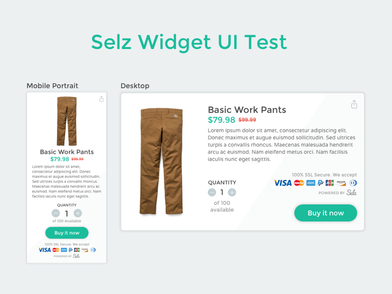

## Demo

Here you can see the demo online: [http://realnerdo.github.io/uideveloper-test/](http://realnerdo.github.io/uideveloper-test/)

## Notes

First, let me say that I enjoyed making this, it was fun. :D
I like widgets, the idea of a small experience focused in one task (Purchase a product in one click).

Like most designers, I'm browsing dribbble, behance, Muzli and many other sites everyday. This time I decided to make it with the diffuse shadow trend. I like shadows when you use them like that. I took inspiration from this post from Muzli: [Long shadow is dead. Welcome Diffuse shadows](https://medium.com/muzli-design-inspiration/long-shadow-is-dead-welcome-diffuse-shadows-6a1f2ee9a6fe#.2srwr2ey0)

I also loved the background of this dribbble shot: [Product Item Card](https://dribbble.com/shots/2226739-Day-002-Product-Item-Card/attachments/413975)

And I came up with this design:

And here's the Sketch file in case you want to take a look: [Dropbox Link](https://www.dropbox.com/s/59zlfy8r2u3rvn7/Selz%20Widget.sketch?dl=0)

### Technologies I used:

- **Gulp** This makes my life a lot easier. I like to automate everything I can, uglify code, prettify code, browserify code, etc.
- **Jade** I'm very quick opening and closing html tags, but I'm a lot faster when I use jade.
- **Sass** The same feeling goes to sass, the ability to make mixins, functions, variables, etc. keeps everything fun.
- **Browseify** I use this when I don't use bower, both are cool, but if I'm already using npm for gulp and dev stuff, I can as well be using browserify for my packages like jquery, handlebars, etc.
- **Handlebars** It's just a lot cleaner to make themes and templates without any programming logic in the templates.
- **JQuery** I can totally code in pure vanilla Javascript, but for this and to make it quick I prefered to use the good old JQuery
- **SVG** I decided to look for my own svg icons and make my own sprite, so I can have a little more control.

### Final thoughts

I enjoyed this test, I love UI and UX. It took me a little bit longer than usual to finish it because I was experimenting a lot. I was browsing your [demo store](http://store.sampotts.me/) and I like how it looks, it's kind of my style as you can see in my [portfolio](http://realnerdo.com). I think I can make good themes with good UI for Selz, whatever I have to learn I can do it with no problem.

Thank you for reading and your time. I'm looking forward for your response.

Regards,

Asael Chavez
